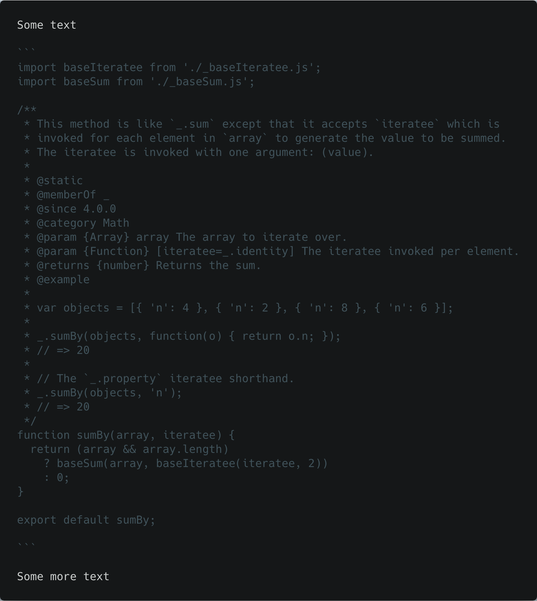
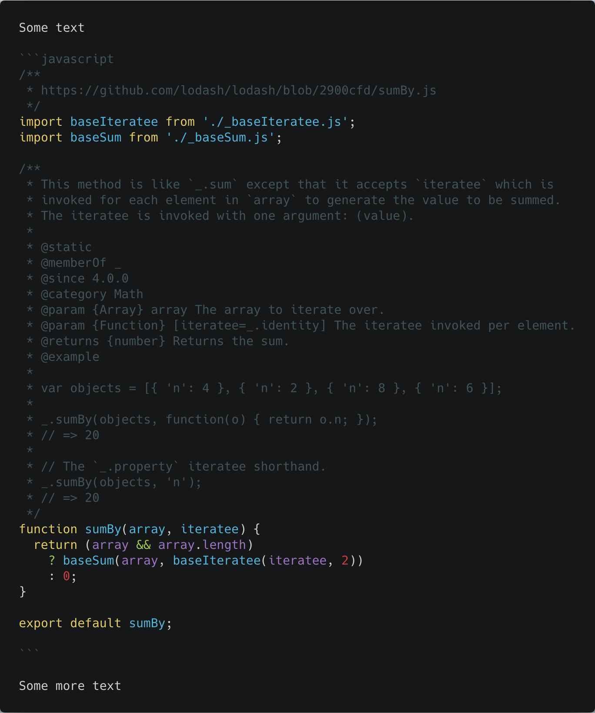

# remark-github-plugin

[](https://www.npmjs.com/package/remark-github-plugin)
[](https://github.com/facebook/jest)
[](https://circleci.com/gh/huy-nguyen/remark-github-plugin/tree/master)

This `remark` plugin replace links to GitHub files with the actual content of those files, wrapped in Markdown code blocks that can optionally be further processed by a syntax highlighter (e.g. [Prism](http://prismjs.com/)).

## Prerequisites

- [NodeJS](https://nodejs.org/en/download/current/). The plugin has been tested on Node 9.
- `npm` or [`yarn`](https://yarnpkg.com/en/docs/getting-started).

## Installation

Install with `npm` or `yarn`:
```bash
npm install remark-github-plugin
# or:
yarn add remark-github-plugin
```

## Usage

First, [create a GitHub personal access token](https://help.github.com/articles/creating-a-personal-access-token-for-the-command-line/) with the `public_repo` scope (if you only need to access public repos) or `repo` scope (if you need to also access private repos).


```javascript
const {plugin} = require('remark-github-plugin');
const remark = require('remark');

const pluginOptions = {
  marker: 'GITHUB-EMBED',
  insertEllipsisComments: true,
  ellipsisPhrase: '...',
  useCache: true,
  cacheKey: 'remark-github-plugin-v1',
  token: '<Your Github Token>',
}

const processor = remark().data(

  // This is optional but recommended. If `fences` is `true`, code blocks with
  // no explicitly set language will be rendered as code blocks. Othewise, they
  // will be rendered as text.
  'settings', {fences: true}
).use(
  plugin, pluginOptions
)

// Read file content:
const fs = require('fs');
const input = fs.readFileSync('path/to/some/markdown/file.md');

// Process input with plugin:
process.process(input, (err, output) => {
  if (err) {
    throw new Error(err);
  }

  console.log(output.contents);
})
```

## Sample input and output

To embed a GitHub file, copy theURL of that file from the browser's location bar and paste it into a new Markdown paragraph that begins and ends with the `marker` phrase. Preferably, that URL should be a [permanent link](https://help.github.com/articles/getting-permanent-links-to-files/) so that the content you're pointing to doesn't change without your knowledge in the future.

For example, with the above config, to embed the file [https://github.com/huy-nguyen/squarify/blob/d7074c2/.babelrc](https://github.com/huy-nguyen/squarify/blob/d7074c2/.babelrc), do this:


This is the Markdown output of the plugin:



You can specify what syntax highlighting should be used by adding a [PrismJs-compatible language code](http://prismjs.com/#languages-list):


This is the Markdown output of the plugin:



You can even pick out individual lines or line ranges from the file.


This is the Markdown output of the plugin:


For a list of supported notations, [click here](https://github.com/euank/node-parse-numeric-range#supported-expressions).

## Configuration
- `marker` (`string`, required): a string to mark the start and end of an embed block e.g. `GITHUB-EMBED`. This string should not have any Markdown special Markdown formatting in there. For exapmle, `GITHUB_EMBED` won't work because before `remark` would have processed it into `GITHUB` and italicized `EMBED`, causing this plugin to not recognize the marker.
- `insertEllipsisComments` (`boolean`, required): whether or not to insert line comments between noncontiguous portions of code. For example, if you chose to insert only lines 1 and 4 of a file into a code block, setting this to `true` will insert a line comment like `// ...` between lines 1 and 4.
  - `ellipsisPhrase` (`string`, required if `insertEllipsisComments` is `true`): The phrase to follow the line comment marker. For example `...` will insert `// ...` between noncontiguous portions of code.
- `useCache` (`boolean`, required): if `true`, the responses of AJAX calls to GitHub will be cached.
  - `cacheKey` (`string`, required if `useCache` is true): this is used for cache busting or to differentiate between potentially other caches stored by [`async-disk-cache`](https://www.npmjs.com/package/async-disk-cache) (which is the caching library used by this package).
- `token` (`string`, required): A [GitHub personal access token](https://help.github.com/articles/creating-a-personal-access-token-for-the-command-line/) with the [`public_repo` scope](https://developer.github.com/apps/building-oauth-apps/scopes-for-oauth-apps/#available-scopes) (if you only need to fetch content from public repos) or [`repo` scope](https://developer.github.com/apps/building-oauth-apps/scopes-for-oauth-apps/#available-scopes) (if you need to also access private repos).
